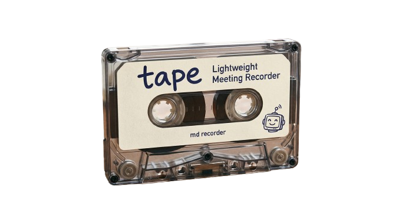

<p align="center">
  
</p>

<p align="center">
  <strong>Local-first meeting recorder for macOS</strong><br>
  Record, transcribe, and save meetings as plain Markdown files.
</p>

<p align="center">
  
  
  
  
</p>

---

## Why tape

Most meeting tools optimize for cloud sync, sharing, and dashboards. **tape** optimizes for a simpler loop:

1. Click **Record**
2. Talk
3. Click **Stop**
4. Get a local `.md` file any agent or editor can read

No cloud account. No browser tab. No weird export step.

## Features

- Lives in the **macOS menu bar** — always one click away
- Records from your microphone with a simple start/stop flow
- **Transcribes locally** with Whisper — nothing leaves your machine
- Saves each recording as a **Markdown file** with YAML frontmatter
- Rename recordings inline and inspect them in a detail panel
- Output is easy for humans and agents to parse

## Example output

Each recording becomes a file you own — easy to grep, sync, or hand to an agent.

```markdown
---
title: "Weekly Sync: Core"
date: 2026-03-31
time: 14:00
duration: 47min
source: Zoom
speakers:
  - Kyle
  - Speaker 2
partial: false
---

## Context

- Roadmap review
- Q2 planning

## Transcript

[00:00] Kyle: ...
```

## Getting started

### Requirements

- macOS 15+
- Xcode 16+

### Build from source

```bash
open Tape.xcodeproj
```

Run the `Tape` scheme. The app appears in the menu bar as a cassette icon.

For a release build:

```bash
xcodebuild -project Tape.xcodeproj -scheme Tape -configuration Release build
```

## Settings

| Setting | Default | Description |
|---|---|---|
| Output folder | `~/Documents/tape/` | Where `.md` files are saved |
| Launch at login | Off | Start tape when you log in |
| Your name | — | Labels your speaker name in transcripts |
| Whisper model | `tiny` | Downloads on first use |
| Min recording | `5s` | Short recordings are discarded |
| Custom vocabulary | — | Bias transcription toward names and terms |

## Whisper models

Models download on first use to `~/Library/Application Support/tape/models/`.

| Model | Size | Notes |
|---|---|---|
| tiny | ~75 MB | Fastest, lightest |
| base | ~142 MB | Better balance |
| small | ~466 MB | Better accuracy |
| medium | ~1.5 GB | High accuracy |
| large-v3 | ~3.1 GB | Highest accuracy, slowest |

## Design philosophy

**tape** is intentionally narrow:

- Manual recording only — no always-on listening
- Local-first transcription — nothing leaves your machine
- One file per recording — no databases or lock-in
- Minimal background behavior — light, predictable, durable

## License

MIT
